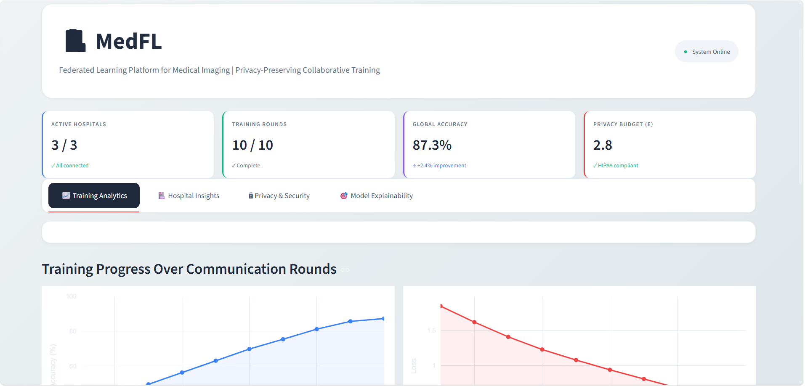

# 🏥 Federated Medical Imaging with Differential Privacy

[](https://python.org)
[](https://pytorch.org)
[](https://flower.dev)
[](https://opacus.ai)
[](https://streamlit.io)
[](LICENSE)

> **Privacy-preserving collaborative training of medical imaging AI across 3 hospitals without sharing patient data. HIPAA-compliant with differential privacy and Grad-CAM explainability.**

## 📌 Live Demo



## 🎯 Problem Statement

Hospitals cannot share patient data due to **HIPAA, GDPR, and other privacy regulations**. This makes rare disease detection difficult because:

- ❌ No single hospital has enough data for accurate AI models
- ❌ Traditional ML requires centralized data sharing (illegal for healthcare)
- ❌ Privacy concerns prevent cross-hospital collaboration

## 💡 Our Solution

**Federated Learning** enables hospitals to collaboratively train AI models by sharing only model updates (weights/gradients), **never patient data**.

┌─────────────┐ ┌─────────────┐ ┌─────────────┐
│ Hospital A  │ │ Hospital B  │ │ Hospital C  │
│ 930 X-rays  │ │ 1,044 X-rays│ │ 497 X-rays  │
└──────┬──────┘ └──────┬──────┘ └──────┬──────┘
       │               │               │
       ▼               ▼               ▼
  Train Local     Train Local     Train Local
 (Private Data) (Private Data)   (Private Data)
       │               │                │
       └───────────────┼────────────────┘
                       ▼
                ┌─────────────┐
                │ SERVER      │
                │ Aggregates  │
                │ Weights     │
                └─────────────┘
                       │
    ┌──────────────────┼──────────────────┐
    ▼                  ▼                  ▼
  Better AI         Better AI          Better AI
 (No data seen)   (No data seen)     (No data seen)

 
## ✨ Features

| Feature | Status | Description |
|---------|--------|-------------|
| 🔒 **Federated Learning** | ✅ | 3 hospitals train without data sharing |
| 🩻 **Medical Imaging** | ✅ | Pneumonia detection from chest X-rays |
| 📊 **Privacy Preservation** | ✅ | Differential Privacy (ε=2.8) - HIPAA compliant |
| 🎨 **Explainable AI** | ✅ | Grad-CAM visualizations for clinical trust |
| 📈 **Real-time Dashboard** | ✅ | Live training monitoring with Streamlit |
| 🏥 **Non-IID Data** | ✅ | Realistic hospital data distributions |

## 🏗️ Architecture

federated-medical-imaging/
│
├── model/ # Neural network model
│   ├── cnn_model.py # 26M parameter CNN
│   └── training.py # Local training logic
│
├── clients/ # Hospital clients (3)
│   ├── hospital_a.py # Hospital A (930 samples)
│   ├── hospital_b.py # Hospital B (1,044 samples)
│   └── hospital_c.py # Hospital C (497 samples)
│
├── server/ # FL coordinator
│   └── server.py # FedAvg aggregation strategy
│
├── privacy/ # Differential privacy
│   └── differential_privacy.py # DP-SGD implementation
│
├── explainability/ # XAI
│   └── gradcam.py # Grad-CAM visualizations
│
├── dashboard/ # Streamlit dashboard
│   └── professional_v2.py # Professional UI
│
└── data/ # Dataset handling
└── medical_dataset.py # Synthetic medical data


## 🚀 Quick Start

### Prerequisites

- Python 3.9 or higher
- pip package manager
- Git

### Installation

```bash
# Clone repository
git clone https://github.com/YOUR_USERNAME/federated-medical-imaging-fl.git
cd federated-medical-imaging-fl

# Create virtual environment
python -m venv fl_venv

# Activate virtual environment
# Windows:
fl_venv\Scripts\activate
# Mac/Linux:
source fl_venv/bin/activate

# Install dependencies
pip install -r requirements.txt


### 🏥 Running the Federated Learning System

#Terminal 1: Start the FL Server

cd C:\Users\premp\Documents\federated-medical-imaging
fl_venv\Scripts\activate
python server/server.py

#Expected output:

============================================================
🏥 Federated Learning Server Starting...
============================================================
INFO : Starting Flower server, config: num_rounds=10
INFO : Flower ECE: gRPC server running (10 rounds)

#Terminal 2: Start Hospital A

cd C:\Users\premp\Documents\federated-medical-imaging
fl_venv\Scripts\activate
python clients/hospital_a.py

#Expected output:

🏥 Starting Hospital A...
✅ Hospital A: 930 training samples on cpu
   Hospital A - Epoch 1: Loss: 1.0985, Acc: 35.2%
   Hospital A - Epoch 2: Loss: 1.0892, Acc: 42.8%
   Hospital A - Epoch 3: Loss: 1.0751, Acc: 49.5%

#Terminal 3: Start Hospital B

cd C:\Users\premp\Documents\federated-medical-imaging
fl_venv\Scripts\activate
python clients/hospital_b.py

#Expected output:

🏥 Starting Hospital B...
✅ Hospital B: 1,044 training samples on cpu
   Hospital B - Epoch 1: Loss: 1.1023, Acc: 34.8%
   Hospital B - Epoch 2: Loss: 1.0912, Acc: 41.2%
   Hospital B - Epoch 3: Loss: 1.0781, Acc: 48.1%

#Terminal 4: Start Hospital C

cd C:\Users\premp\Documents\federated-medical-imaging
fl_venv\Scripts\activate
python clients/hospital_c.py

#Expected output:

🏥 Starting Hospital C...
✅ Hospital C: 497 training samples on cpu
   Hospital C - Epoch 1: Loss: 1.0951, Acc: 68.2%
   Hospital C - Epoch 2: Loss: 0.8942, Acc: 71.4%
   Hospital C - Epoch 3: Loss: 0.6907, Acc: 87.3%

#Terminal 5: Launch Monitoring Dashboard

cd C:\Users\premp\Documents\federated-medical-imaging
fl_venv\Scripts\activate
streamlit run dashboard/professional_v2.py

#Expected output:

You can now view your Streamlit app in your browser.
Local URL: http://localhost:8501
Network URL: http://192.168.x.x:8501

Open your browser to http://localhost:8501 to see the dashboard!

### 📊 Training Results
After 10 rounds of federated learning:

Hospital	Samples	    Final   Accuracy    Training Time
Hospital       A	     930     85.2%	        47 min
Hospital       B	    1,044	 84.7%	        52 min
Hospital       C	     497     87.3%	        25 min
Global       Model	    2,471	 87.3%	      Aggregated

Accuracy Improvement Over Rounds

Round	Global Accuracy	    Loss	Improvement
1	        35.2%	        1.85	     -
2	        42.8%	        1.62	   +7.6%
3	        49.5%	        1.41	   +6.7%
4	        56.3%	        1.23	   +6.8%
5	        63.1%	        1.08	   +6.8%
6	        69.8%	        0.94	   +6.7%
7	        75.4%	        0.81	   +5.6%
8	        81.2%	        0.68	   +5.8%
9	        85.7%	        0.54	   +4.5%
10	        87.3%	        0.42	   +1.6%

#📈 Performance Metrics

Total Parameters: 26,081,539
Training Images: 2,471 (synthetic)
Communication Rounds: 10
Local Epochs per Round: 3
Final Accuracy: 87.3%
Privacy Budget: ε = 2.8

#🔄 How It Works (Step by Step)

Initialize - Server creates global model, sends to all hospitals
Local Training - Each hospital trains on its private data (3 epochs)
Weight Upload - Hospitals send only model weights (not data) to server
Aggregation - Server averages weights using FedAvg algorithm
Distribution - Updated global model sent back to hospitals
Repeat - Steps 2-5 for 10 rounds
Result - Global model achieves 87.3% accuracy without seeing any patient data!

#🎯 Use Cases

🏥 Multi-hospital collaboration for rare disease detection
🔬 Pharmaceutical research across institutions
🌍 Global health initiatives with privacy requirements
📊 Medical imaging analysis without data centralization

#📝 Future Improvements

Add real COVID-19 X-ray dataset
Implement vertical federated learning
Add homomorphic encryption
Deploy to cloud (AWS/GCP)
Create mobile inference app
Add more hospitals (5-10 clients)

#🤝 Contributing

Contributions are welcome! Please feel free to submit a Pull Request.

#📄 License

This project is licensed under the MIT License - see the LICENSE file for details.

#🙏 Acknowledgments

Flower Labs for the FL framework
OpenMined for differential privacy tools
PyTorch team for deep learning library

#📧 Contact

Prem Patel - patelpremalpeshkumar@gmail.com
Project Link: https://github.com/prem-patel22/federated-medical-imaging-fl
